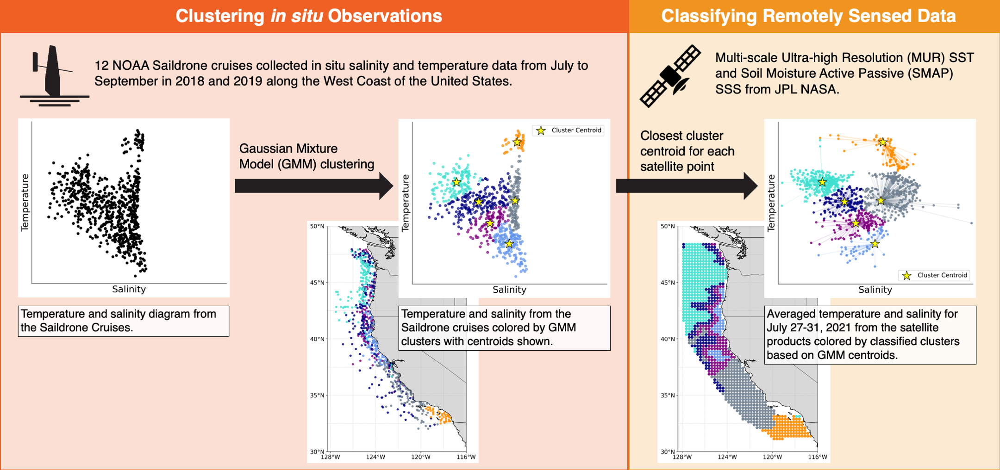

Repository of code for the Paper: 

## Characterizing the California Current System through Sea Surface Temperature and Salinity

### Marisol García-Reyes*, Gammon Koval, Jorge Vazquez-Cuervo

Citation:  García-Reyes M, Koval G, and Vazquez-Cuervo J (2024) Characterizing the California Current System through Sea Surface Temperature and Salinity. Remote Sensing 16, no. 8: 1311. [https://doi.org/10.3390/rs16081311](https://doi.org/10.3390/rs16081311) 

## Abstract

Characterizing temperature and salinity (T-S) conditions is a standard framework in oceanography to identify and describe deep water masses and their dynamics. At the surface, this practice is hindered by multiple air–sea–land processes impacting T-S properties at shorter time scales than can easily be monitored. Now, however, the unsurpassed spatial and temporal coverage and resolution achieved with satellite sea surface temperature (SST) and salinity (SSS) allow us to use these variables to investigate the variability of surface processes at climate-relevant scales. In this work, we use SSS and SST data, aggregated into domains using a cluster algorithm over a T-S diagram, to describe the surface characteristics of the California Current System (CCS), validating them with in situ data from uncrewed Saildrone vessels. Despite biases and uncertainties in SSS and SST values in highly dynamic coastal areas, this T-S framework has proven useful in describing CCS regional surface properties and their variability in the past and in real time, at novel scales. This analysis also shows the capacity of remote sensing data for investigating variability in land–air–sea interactions not previously possible due to limited in situ data.

Link to paper: [https://www.mdpi.com/2072-4292/16/8/1311](https://www.mdpi.com/2072-4292/16/8/1311)

&#8291;* Corresponding author: Marisol García-Reyes, [marisolgr@faralloninstitute.org](mailto:marisolgr@faralloninstitute.org)

## Graphical Abstract

